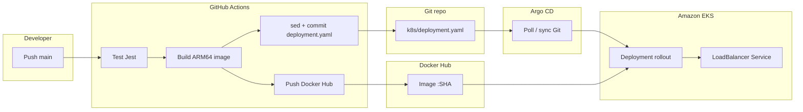

# Todo App — EKS & GitOps

A **Todo** web app (Node.js + Express) built to learn **Amazon EKS**, **CI/CD with GitHub Actions**, and **GitOps with Argo CD**. Application code, Kubernetes manifests, and the pipeline live in one repository to mirror a realistic workflow: test → build image → update Git → cluster reconciles from Git.

---

## Contents

- [Overview](#overview)
- [Tech stack](#tech-stack)
- [Architecture & data flow](#architecture--data-flow)
- [Project structure](#project-structure)
- [Workflow implemented](#workflow-implemented)
- [Run locally](#run-locally)
- [CI/CD & deployment](#cicd--deployment)
- [Further reading](#further-reading)

---

## Overview

| Aspect | Description |
|--------|-------------|
| **Purpose** | Todo web app with a REST API (`/api/todos`), static UI under `public/`, and a `/health` endpoint for Kubernetes probes. |
| **Runtime** | Node.js 20, Express 4. |
| **Data** | In-memory storage — fine for demos; no database so the focus stays on DevOps. |
| **Delivery** | **linux/arm64** container (Alpine Dockerfile), image pushed to Docker Hub; EKS runs a Deployment plus a LoadBalancer Service. |
| **GitOps** | Argo CD watches the `main` branch and syncs `deployment.yaml` and `service.yaml` to the cluster. |

---

## Tech stack

| Layer | Tools |
|-------|--------|
| **App** | Node.js, Express, Jest, Supertest |
| **Container** | Docker (multi-platform build: QEMU + Buildx), `node:20-alpine` base image |
| **CI/CD** | GitHub Actions — test, build & push, auto-commit manifest updates |
| **Registry** | Docker Hub |
| **Cluster** | Amazon EKS (example region: `ap-southeast-1`), ARM node group (`t4g.small`) via **eksctl** |
| **Cluster definition** | `k8s/cluster.yaml` (eksctl ClusterConfig) |
| **Orchestration** | Kubernetes — Deployment, Service, probes |
| **GitOps** | Argo CD — Application pointing at the Git repo, automated sync |

---

## Architecture & data flow

End-to-end flow from commit to a new pod:



**Roles in short:** GitHub Actions builds the image and tags it with the commit **short SHA**, writes that tag into `k8s/deployment.yaml`, and pushes back to Git. Argo CD picks up the change (poll every few minutes or manual sync), applies manifests on EKS; the kubelet pulls the new image and rolls out the Deployment.

---

## Project structure

```
todo-app/
├── server.js                 # Express entry, API & static files
├── public/                   # Static assets
├── views/                    # index.html
├── tests/                    # Jest + Supertest
├── Dockerfile                # ARM64, non-root `node` user, port 3000
├── package.json
├── k8s/
│   ├── deployment.yaml       # Image + /health probes
│   ├── service.yaml          # LoadBalancer 80 → 3000
│   ├── argocd-application.yaml
│   └── cluster.yaml          # eksctl (EKS + node group)
├── .github/workflows/ci.yaml # CI/CD pipeline
└── docs/
    └── ARGOCD.md             # Detailed Argo CD setup
```

---

## Workflow implemented

These steps match what this repository configures:

1. **Application development**  
   Todo API (filter, sort, CRUD), web UI, `/health` for Kubernetes.

2. **Automated tests**  
   Jest + Supertest; `npm test` on every PR or push to `main`.

3. **Containerization**  
   Single-stage Dockerfile on Alpine ARM64, `npm ci --production`, runs as a non-root user.

4. **EKS cluster definition**  
   `k8s/cluster.yaml` with eksctl: name, region, managed ARM node group.

5. **Kubernetes manifests**  
   Deployment (resource limits, liveness/readiness), LoadBalancer Service.

6. **GitHub Actions pipeline**  
   - On PR/push: **tests only**.  
   - On push to `main`: test → build **linux/arm64** image → push to Docker Hub (`DOCKER_IMAGE:tag`) → **update** `k8s/deployment.yaml` with `sed` → bot commit `ci: update image tag …`.

7. **GitOps with Argo CD**  
   Install Argo CD on EKS, register an Application targeting the repo and `k8s/` path, include only `deployment.yaml` and `service.yaml`, enable automated sync (and self-heal to match Git).

8. **Verification**  
   Inspect pods and Deployment image, reach the app via the Service EXTERNAL-IP (and Argo CD UI if needed).

---

## Run locally

**Requirements:** Node.js 20+.

```bash
npm ci
npm run dev          # or: npm start
```

Listens on port **3000** by default (or `PORT` from the environment).

**Tests:**

```bash
npm test
```

**Docker (example):**

```bash
docker build -t todo-app:local .
docker run --rm -p 3000:3000 todo-app:local
```

---

## CI/CD & deployment

### GitHub repository secrets

| Secret | Purpose |
|--------|---------|
| `DOCKERHUB_USERNAME` | Docker Hub login when pushing the image |
| `DOCKERHUB_TOKEN` | Docker Hub access token |

The workflow uses `DOCKER_IMAGE` in `.github/workflows/ci.yaml` (e.g. `tooltu/todov2`) — set it to match your Docker Hub repository.

### EKS & kubectl

- Create or update the cluster using `k8s/cluster.yaml` and the [eksctl](https://eksctl.io/) docs.  
- Configure kubeconfig: `aws eks update-kubeconfig --region <region> --name <cluster>`.

### Argo CD

Step-by-step setup (install, UI, private repo, Application, end-to-end check) is in [**docs/ARGOCD.md**](docs/ARGOCD.md). Before applying `k8s/argocd-application.yaml`, set `repoURL` to your GitHub repository.

### Apply manifests without Argo CD

```bash
kubectl apply -f k8s/deployment.yaml
kubectl apply -f k8s/service.yaml
```

---

## Further reading

| Document | Contents |
|----------|----------|
| [docs/ARGOCD.md](docs/ARGOCD.md) | Install Argo CD, LoadBalancer UI, GitHub secret, sync Application, uninstall |

---

*Learning project for DevOps — CI/CD, containers, Kubernetes on AWS, and GitOps.*
